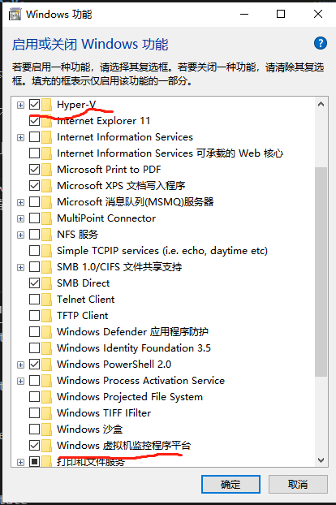
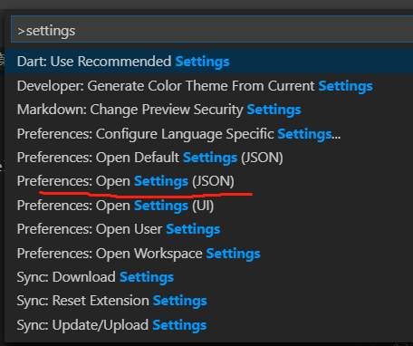

# flutter-doc

## 使用vscode创建第一个App

### vscode下载flutter和dart插件

### 安装Flutter SDK

1、打开 https://flutter.dev/docs/get-started/install/windows，找到Get the Flutter SDK并下载

2、设置bin文件夹路径的环境变量，

### 安装硬件加速

window7需要安装HAXM

window10建议使用Hyper-V进行加速,这样不会跟Docker发生冲突

####　修改模拟器虚拟化技术为Hyper-V：

windows 版本需要是 Windows10 2018 April（Windows 1803）及以上版本

Android Studio 3.2 beta 及以上版本

Android Emulator v27.3.8 及以上版本

$ winver 查看电脑版本（升级攻略网上搜）

1、首先打开 windows功能(点击windows ,搜索一下)，勾选 Hyper-V相关的功能，勾选Windows Hypervisor Platform 或者 ，则将其勾选上，否则转下步



2、重启电脑

### Run flutter doctor -v

在终端输入：flutter docker -v 检查缺少的依赖并安装，成功后重启vscode

若是使用vscode编译的话，也强烈建议安装android studio，因为由于墙的原因以及android studio内置的AVD支持Hyper-V硬件加速等问题很多，后面的教程都是基于此写的

android studio 下载地址：https://developer.android.google.cn/studio?hl=zh_cn

android sdk 安装教程：https://blog.csdn.net/lilongwei000/article/details/88870272


环境变量名：ANDROID_HOME

android sdk: 环境变量设置

%ANDROID_HOME%\tools

%ANDROID_HOME%\platforms

%ANDROID_HOME%\platform-tools


#### Android license status unknown

$ flutter doctor --android-licenses

若是有报错：Exception in thread "main" java.lang.UnsupportedClassVersionError: 

一般是JDK版本过高，无法兼容，降级到1.8可行

实在不行，先放着，暂时不影响开发


### 设置 Android emulator

配置模拟器教程： https://blog.csdn.net/zha6476003/article/details/80785344

1、启用 VM acceleration

2、启动 Android Studio > Tools > Android > AVD Manager and select Create Virtual Device

3、在vscode终端中输入: flutter create myappp

4、cd myapp

5、 ctrl+shift+p 打开command pallet,输入Flutter:Select Device

6、flutter run

### 解决pub get 下载超慢的问题

打开“环境变量”，新添系统变量：

PUB_HOSTED_URL=https://pub.flutter-io.cn

FLUTTER_STORAGE_BASE_URL=https://storage.flutter-io.cn

### VSCODE 配置问题

1、打开Command Palette -> Settings:



2、粘贴以下代码：

```
"dart.debugExternalLibraries": true,
"dart.debugSdkLibraries": true,
"dart.enableCompletionCommitCharacters": true,
"dart.flutterHotRestartOnSave": true,
"dart.lineLength": 120,
"dart.previewFlutterUiGuides": true,
"dart.triggerSignatureHelpAutomatically": true
```

